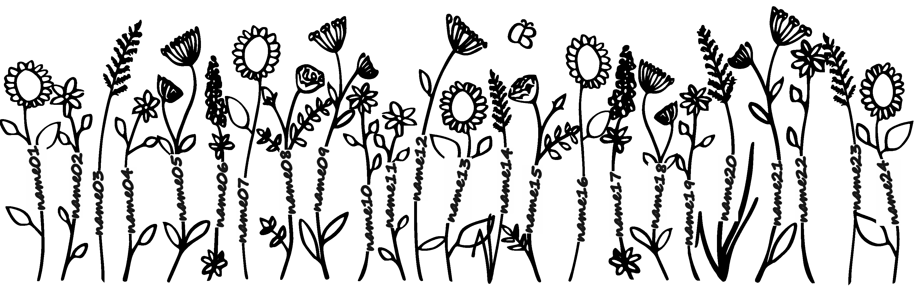
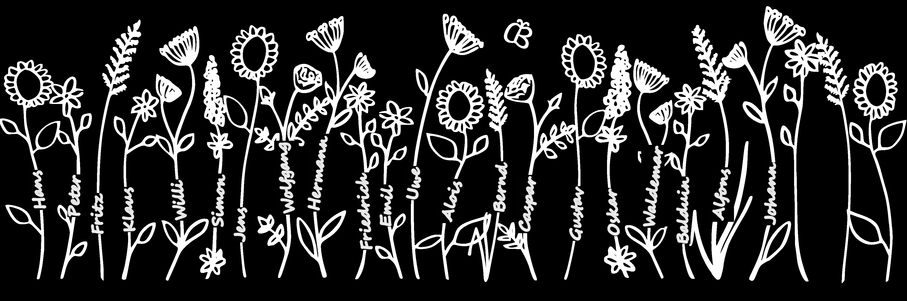
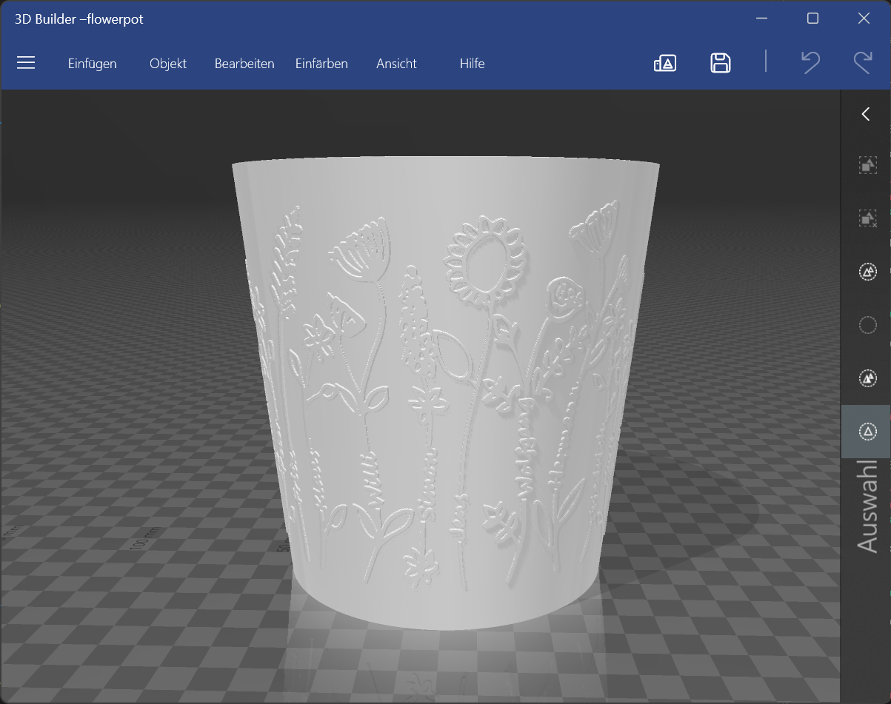
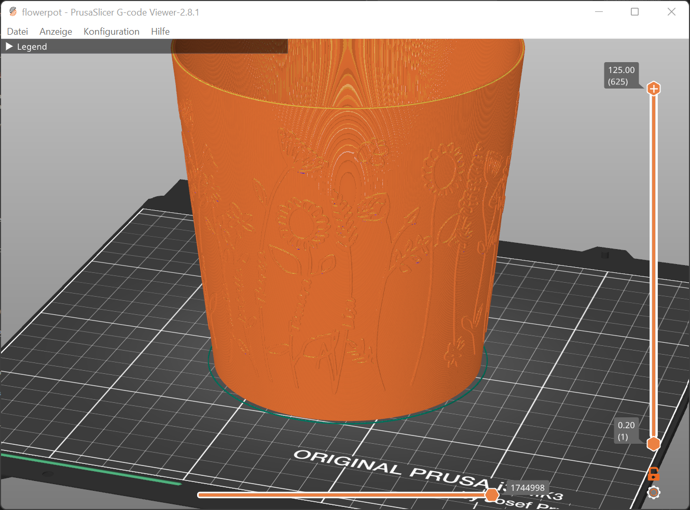

# svg_automation_flowers
Project to further automate the manipulation of my personalized flower design.  

## Table of Contents
1.[Installation](#installation)
2.[Project Motivation](#motivation)
3.[File Descriptions](#files)
4.[Results](#results)
5.[Licensing, Authors, and Acknowledgements](#licensing)

## Installation 

The code is written using Pythons version 3.11.0. All libraries are available within the Anaconda distribution of Python.
To execute the code, installations of Inkscape 1.2, Blender 3.6 and PrusaSlicer 2.8.1 are required.

## Project Motivation 

In this project, I automated the personalization of my 3D Designs. The program completely replaces the time consuming process of changing names directly in the design and thereby makes the creation process of my personalized 3D flower pots more efficient. The code creates changed image files, the stl of the 3D model and the gcode to finally print the design.

## File Descriptions 

insert_names.py: Script that alters my 3D-model by inserting names from a csv-file into a svg-file, converting it to png and updating the stl of the flowerpot. 
generate_gcode.py: Script that creates the gcode from the resulting stl-file in prusa slicer with my own configurations.

## Results 

The following tasks are peformed by my Python script:
* Import CSV with names
* Open template and copy it to new file
* Replace name placeholder by name
* Save changes in new svg-file
* Export image to png or jpg and invert colors.
* Create stl with updated surface

### Template

### Modified Image

### Modified 3D Model

### GCode File

For more information about my project please refer to my blog post on https://breuerei.de/automating-my-personalized-3d-designs-with-python/

## Licensing, Authors, Acknowledgements 

Please feel free to use and modify the code for your own projects. However, all designs showcased in this repository are the sole property of the author and are protected by copyright; unauthorized use, reproduction, or distribution is strictly prohibited.
